# 🏥 MediCare - Online Pharmacy Platform

A full-stack e-commerce pharmacy platform built with the MERN stack (MongoDB, Express.js, React, Node.js). MediCare enables customers to browse medicines, place orders, and make secure online payments, while providing administrators with comprehensive tools to manage products, orders, and users.

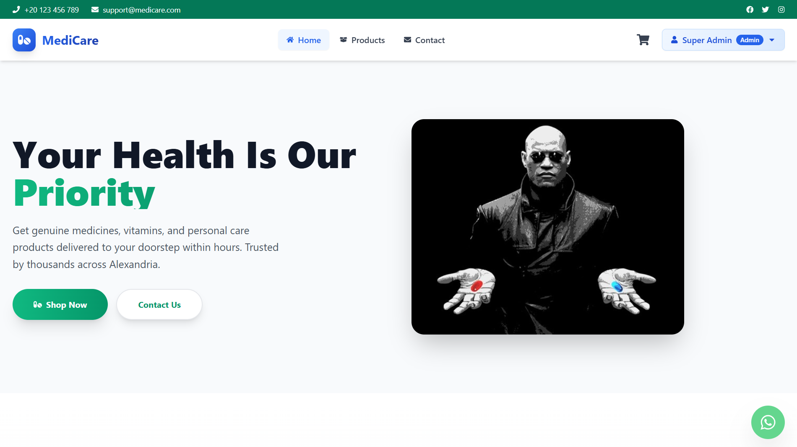

## ✨ Features

### 🛒 Customer Features
- **Product Browsing**: Search, filter, and view detailed information about medicines and health products
- **Smart Shopping Cart**: Add/remove items with real-time stock validation
- **Secure Checkout**: Integrated PayMob payment gateway for safe transactions
- **Order Tracking**: View order history and real-time status updates
- **User Dashboard**: Manage profile, addresses, and view order history
- **Responsive Design**: Optimized for desktop, tablet, and mobile devices

### 👨‍💼 Admin Features
- **Dashboard Analytics**: Overview of sales, orders, and inventory metrics
- **Product Management**: Add, edit, delete products with image upload
- **Inventory Control**: Real-time stock management with low-stock alerts
- **Order Management**: Update order status, view customer details
- **User Management**: Role-based access control (Super Admin/Admin/User)
- **Contact Messages**: View and manage customer inquiries

### 🔐 Security Features
- JWT-based authentication
- Password encryption with bcrypt
- Role-based authorization (RBAC)
- Protected API routes
- Secure payment processing via PayMob

## 📸 Screenshots

### Home Page

*Modern hero section with featured products and services*

### Product Catalog
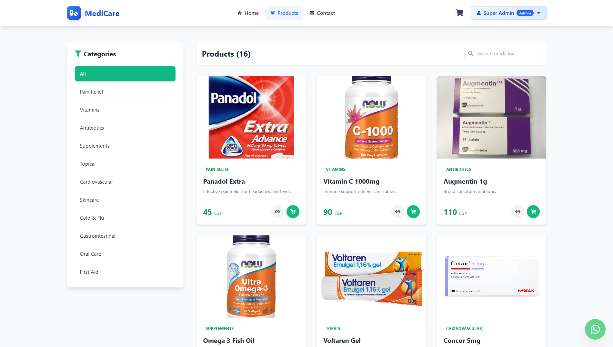
*Browse products with category filters and search functionality*

### Product Details
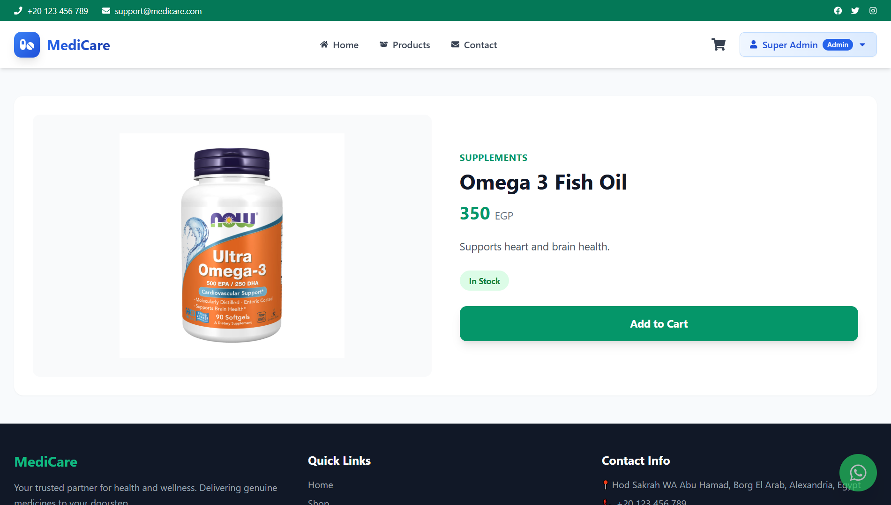
*Detailed product information with add-to-cart functionality*

### Shopping Cart
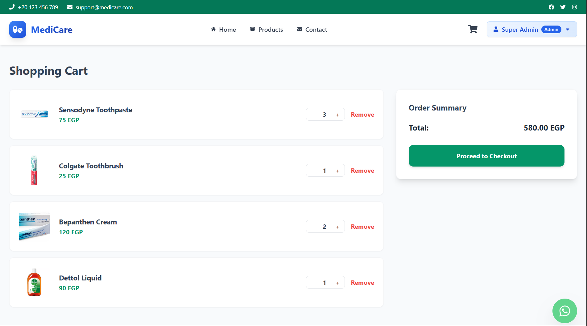
*Review items before checkout with quantity controls*

### Contact Page
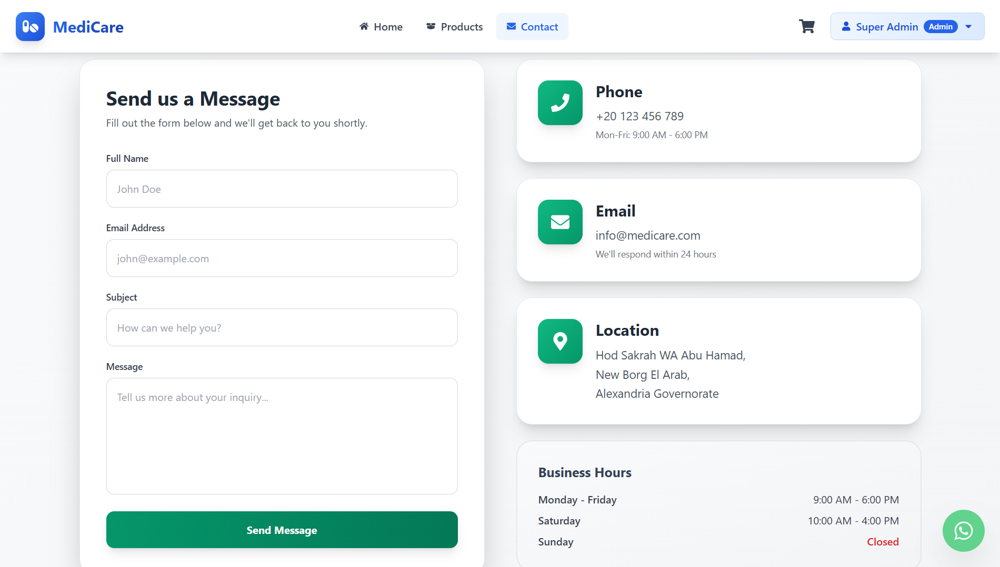
*Contact form that sends inquiries directly to admin dashboard*

### User Dashboard - Profile
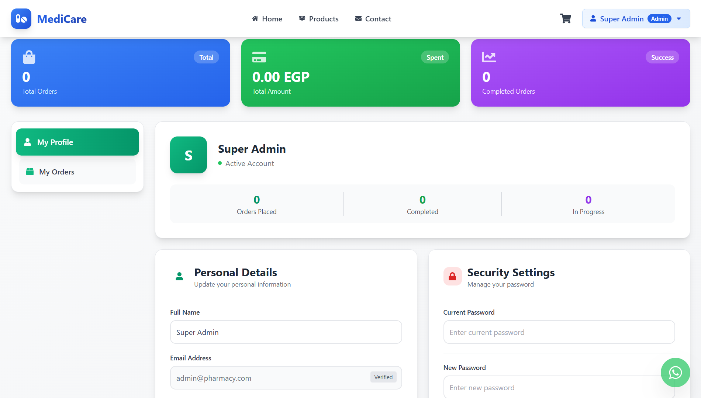
*Manage personal information, update profile, and change password securely*

### User Dashboard - Orders
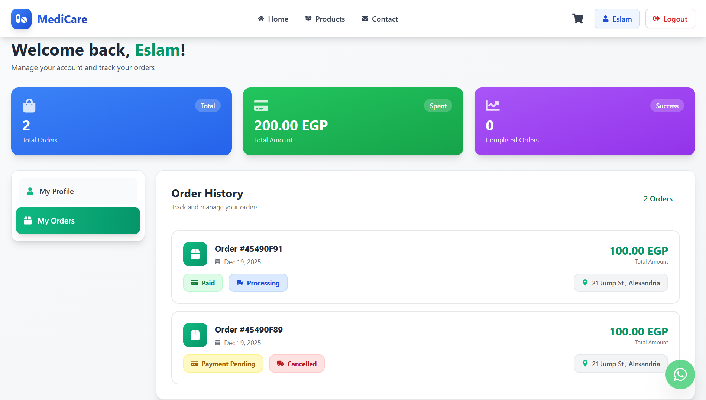
*Track order history with real-time status updates and detailed order information*

### Admin Dashboard
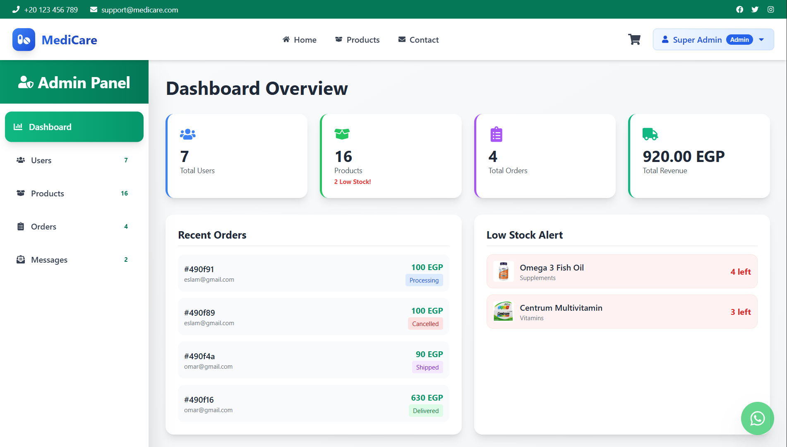
*Comprehensive analytics dashboard with sales metrics, order statistics, and inventory alerts*

### Admin - Order Management
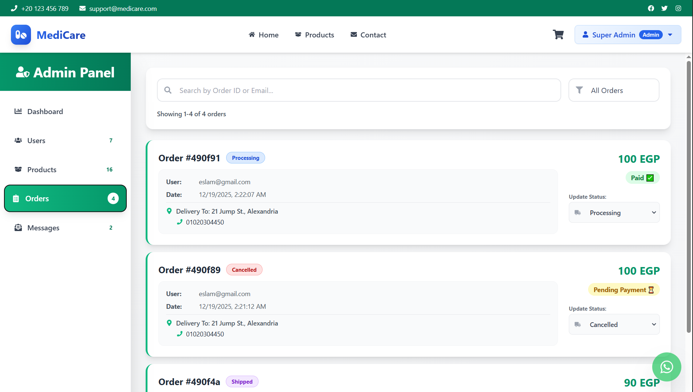
*Manage all customer orders with search, filter, and status update capabilities*

### Single Order details (User/Admin)
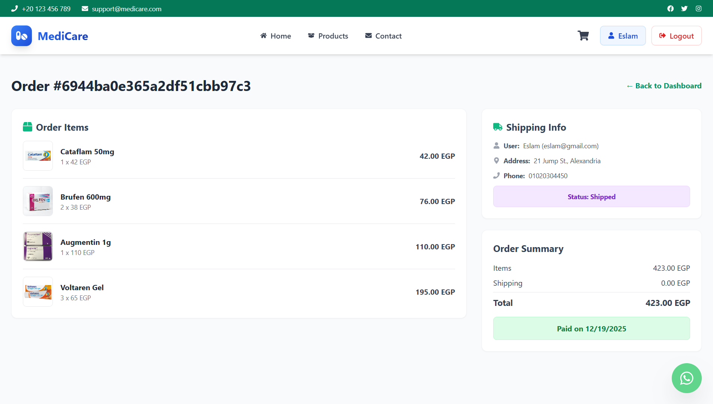
*View complete order breakdown including items, shipping details, and payment status*

### Admin - User Management
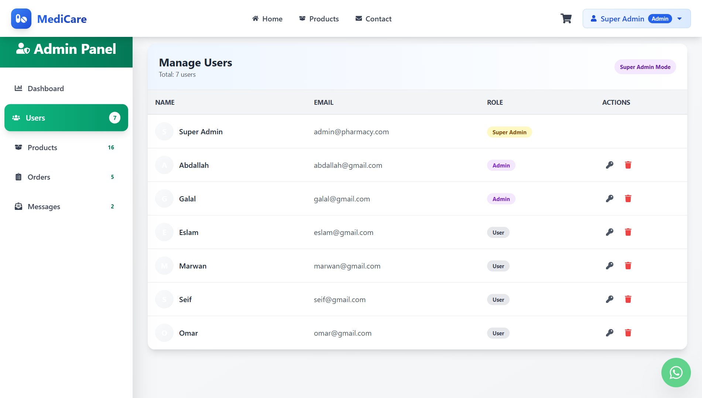
*Manage user accounts with role-based access control and permissions*

### Admin - Product Management
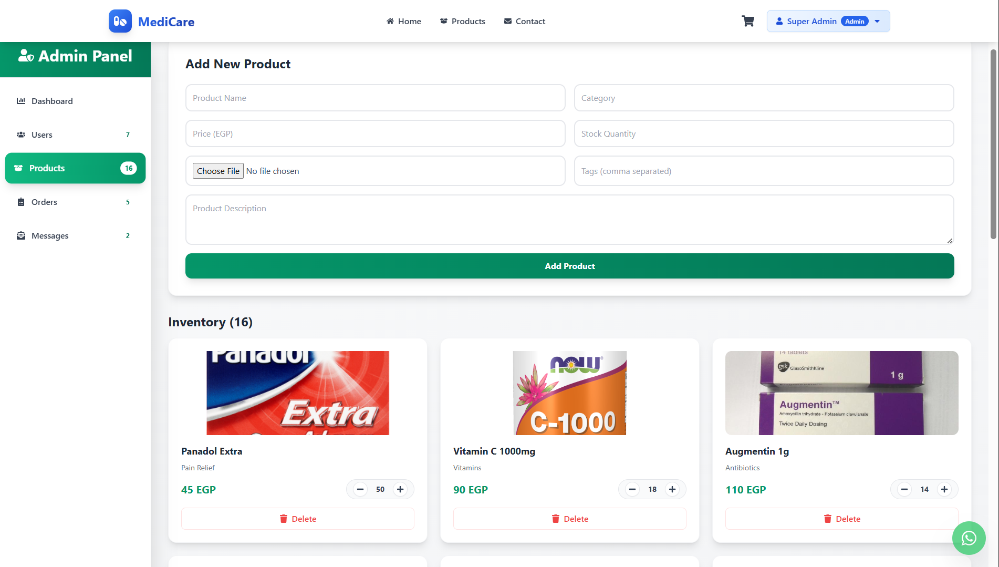
*Complete inventory control with real-time stock adjustments and product CRUD operations*

### Admin - Contact Messages
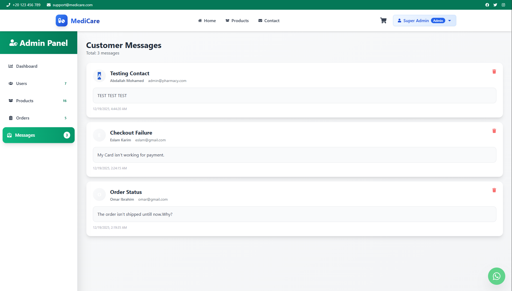
*View and manage customer inquiries submitted through the contact form*

### 404 Error Page
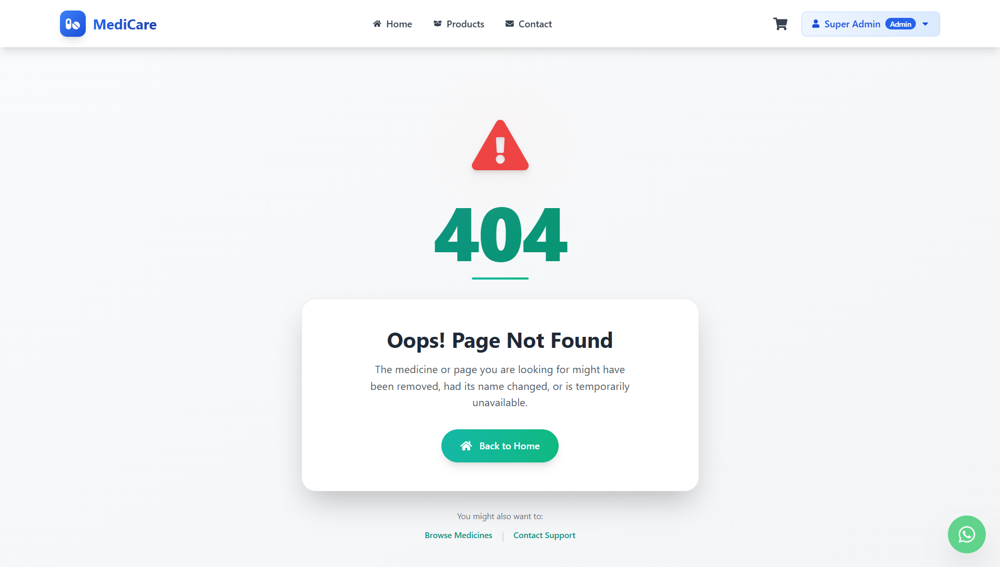
*User-friendly error page with navigation options when page is not found*

## 🛠️ Tech Stack

### Frontend
- **React 18** - UI library
- **React Router v6** - Client-side routing
- **Tailwind CSS** - Utility-first CSS framework
- **Axios** - HTTP client
- **React Toastify** - Toast notifications
- **React Icons** - Icon library
- **Vite** - Build tool and dev server

### Backend
- **Node.js** - Runtime environment
- **Express.js** - Web framework
- **MongoDB** - NoSQL database
- **Mongoose** - MongoDB ODM
- **JWT** - Authentication tokens
- **Bcrypt.js** - Password hashing
- **Multer** - File upload handling
- **PayMob API** - Payment gateway integration

## 📋 Prerequisites

Before running this project, make sure you have:

- **Node.js** (v16 or higher)
- **MongoDB** (local installation or MongoDB Atlas account)
- **PayMob Account** (for payment integration)
- **Git** (for cloning the repository)

## 🚀 Installation & Setup

### 1. Clone the Repository

```bash
git clone https://github.com/yourusername/medicare-pharmacy.git
cd medicare-pharmacy
```

### 2. Backend Setup

```bash
cd backend
npm install
```

Create a `.env` file in the `backend` directory:

```env
NODE_ENV=development
PORT=5000
MONGO_URI=your_mongodb_connection_string
JWT_SECRET=your_jwt_secret_key_here
PAYMOB_API_KEY=your_paymob_api_key
PAYMOB_INTEGRATION_ID=your_paymob_integration_id
PAYMOB_IFRAME_ID=your_paymob_iframe_id
```

**Seed the Database** (creates admin user and sample products):

```bash
npm run seed
```

Default Admin Credentials:
- **Email**: admin@pharmacy.com
- **Password**: admin123

**Start Backend Server**:

```bash
npm run dev
```

Backend will run on `http://localhost:5000`

### 3. Frontend Setup

Open a new terminal:

```bash
cd frontend
npm install
```

Create a `.env` file in the `frontend` directory (if needed):

```env
VITE_API_URL=http://localhost:5000
```

**Start Frontend Server**:

```bash
npm run dev
```

Frontend will run on `http://localhost:5173`

## 📁 Project Structure

```
medicare-pharmacy/
├── backend/
│   ├── data/                 # Sample product data
│   ├── middleware/           # Auth & error handling
│   ├── models/              # MongoDB schemas
│   │   ├── Contact.js
│   │   ├── Order.js
│   │   ├── Product.js
│   │   └── User.js
│   ├── routes/              # API endpoints
│   │   ├── authRoutes.js
│   │   ├── contactRoutes.js
│   │   ├── orderRoutes.js
│   │   ├── paymentRoutes.js
│   │   ├── productRoutes.js
│   │   └── userRoutes.js
│   ├── scripts/             # Database seeder
│   ├── uploads/             # Product images
│   ├── server.js            # Express app entry point
│   └── package.json
│
├── frontend/
│   ├── public/              # Static assets
│   ├── src/
│   │   ├── components/      # Reusable components
│   │   │   ├── Footer.jsx
│   │   │   ├── Navbar.jsx
│   │   │   ├── ProductCard.jsx
│   │   │   ├── TopBar.jsx
│   │   │   └── WhatsAppButton.jsx
│   │   ├── pages/           # Page components
│   │   │   ├── AdminDashboard.jsx
│   │   │   ├── Cart.jsx
│   │   │   ├── Checkout.jsx
│   │   │   ├── Contact.jsx
│   │   │   ├── Home.jsx
│   │   │   ├── Login.jsx
│   │   │   ├── NotFound.jsx
│   │   │   ├── OrderPage.jsx
│   │   │   ├── PaymentCallback.jsx
│   │   │   ├── ProductDetails.jsx
│   │   │   ├── Register.jsx
│   │   │   ├── Shop.jsx
│   │   │   └── UserDashboard.jsx
│   │   ├── App.jsx          # Main app component
│   │   ├── main.jsx         # React entry point
│   │   └── index.css        # Global styles
│   ├── index.html
│   ├── tailwind.config.js
│   ├── vite.config.js
│   └── package.json
│
└── README.md
```

## 🔑 Key Features Explained

### Authentication System
- JWT-based token authentication
- Protected routes for user and admin access
- Password change functionality with verification
- Automatic token refresh on page reload

### Shopping Cart
- User-specific cart storage (localStorage)
- Real-time stock validation
- Persistent cart across sessions
- Quantity controls with stock limits

### Payment Integration
The platform uses **PayMob** payment gateway:

1. User completes checkout form
2. Order is created in database
3. Payment request sent to PayMob
4. User redirected to PayMob iframe
5. Payment callback verifies transaction
6. Stock is decremented on successful payment
7. Order status updated automatically

### Admin Panel
Three-tier permission system:
- **Super Admin**: Full access (cannot be deleted)
- **Admin**: Product and order management
- **User**: Shopping and order viewing

## 🎨 Design Features

- **Gradient Accents**: Modern gradient backgrounds for visual appeal
- **Responsive Grid**: Adapts seamlessly from mobile to desktop
- **Micro-interactions**: Hover effects and smooth transitions
- **Icon Integration**: React Icons for consistent visual language
- **Loading States**: Skeleton screens and spinners for better UX
- **Toast Notifications**: Real-time feedback for user actions

## 📊 Database Schema

### User Model
```javascript
{
  name: String,
  email: String (unique),
  password: String (hashed),
  phone: String,
  address: String,
  city: String,
  isAdmin: Boolean
}
```

### Product Model
```javascript
{
  name: String,
  image: String,
  description: String,
  category: String,
  price: Number,
  countInStock: Number,
  tags: [String]
}
```

### Order Model
```javascript
{
  user: ObjectId (ref: User),
  orderItems: [{
    name, qty, image, price,
    product: ObjectId (ref: Product)
  }],
  shippingAddress: {
    address, city, country, phone
  },
  paymentMethod: String,
  totalPrice: Number,
  isPaid: Boolean,
  paidAt: Date,
  status: String
}
```

## 🔧 API Endpoints

### Authentication
- `POST /api/auth/register` - Register new user
- `POST /api/auth/login` - User login
- `PUT /api/auth/profile` - Update user profile

### Products
- `GET /api/products` - Get all products
- `GET /api/products/:id` - Get single product
- `POST /api/products` - Create product (Admin)
- `PUT /api/products/:id` - Update product (Admin)
- `DELETE /api/products/:id` - Delete product (Admin)

### Orders
- `POST /api/orders` - Create new order
- `GET /api/orders/myorders` - Get user's orders
- `GET /api/orders` - Get all orders (Admin)
- `GET /api/orders/:id` - Get single order
- `PUT /api/orders/:id/status` - Update order status (Admin)

### Payment
- `POST /api/payment/init` - Initialize PayMob payment
- `POST /api/payment/verify` - Verify payment callback

### Users (Admin)
- `GET /api/users` - Get all users
- `DELETE /api/users/:id` - Delete user
- `PUT /api/users/:id/role` - Toggle admin role
- `PUT /api/users/:id/force-password` - Reset user password

## 🌐 Deployment

### Backend Deployment (e.g., Render, Railway, Heroku)

1. Set environment variables in hosting platform
2. Update MongoDB connection to production database
3. Configure allowed origins for CORS
4. Deploy backend code

### Frontend Deployment (e.g., Vercel, Netlify)

1. Update API base URL to production backend
2. Build production bundle: `npm run build`
3. Deploy `dist` folder or connect Git repository

### Important Notes
- Update `vite.config.js` proxy for production
- Configure MongoDB Atlas IP whitelist
- Set up PayMob production credentials
- Enable HTTPS for secure transactions

## 🤝 Contributing

Contributions are welcome! Please follow these steps:

1. Fork the repository
2. Create a feature branch (`git checkout -b feature/AmazingFeature`)
3. Commit changes (`git commit -m 'Add some AmazingFeature'`)
4. Push to branch (`git push origin feature/AmazingFeature`)
5. Open a Pull Request

## 📝 License
This project is licensed under the MIT License - see the LICENSE file for details.

## 👨‍💻 Author

**Abdallah Mohamed**
- GitHub: [@xxBINGOxx][ https://github.com/xxBINGOxx ]
- Email: abdallah1intel1@gmail.com
  
## 🙏 Acknowledgments
- Product images from various pharmaceutical companies
- Icons from [React Icons](https://react-icons.github.io/react-icons/)
- UI inspiration from modern e-commerce platforms
- PayMob for payment gateway services


**Note**: This is a demonstration project. For production use, implement additional security measures, comprehensive testing, and proper error handling.

## 🎯 Future Enhancements

- [ ] Prescription upload and verification
- [ ] Real-time chat support
- [ ] Email notifications for orders
- [ ] Advanced analytics dashboard
- [ ] Multi-language support
- [ ] Wishlist functionality
- [ ] Product reviews and ratings
- [ ] Loyalty points system
- [ ] SMS notifications
- [ ] Export orders to PDF/Excel
